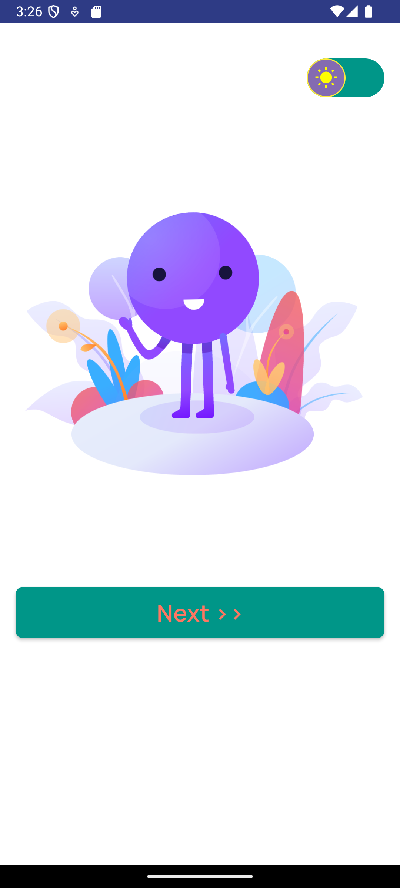
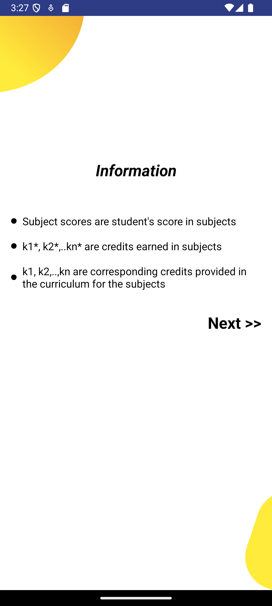
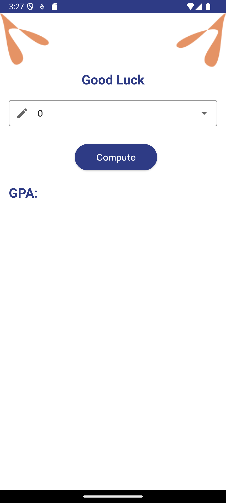
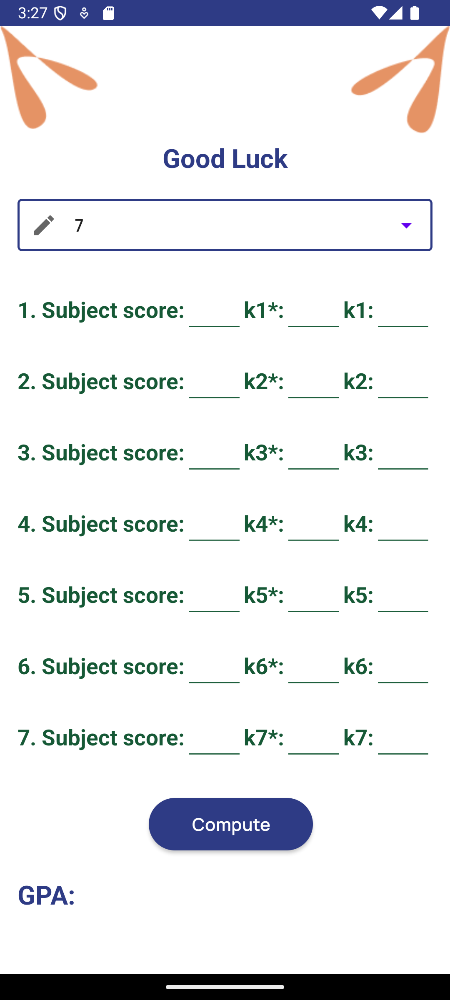
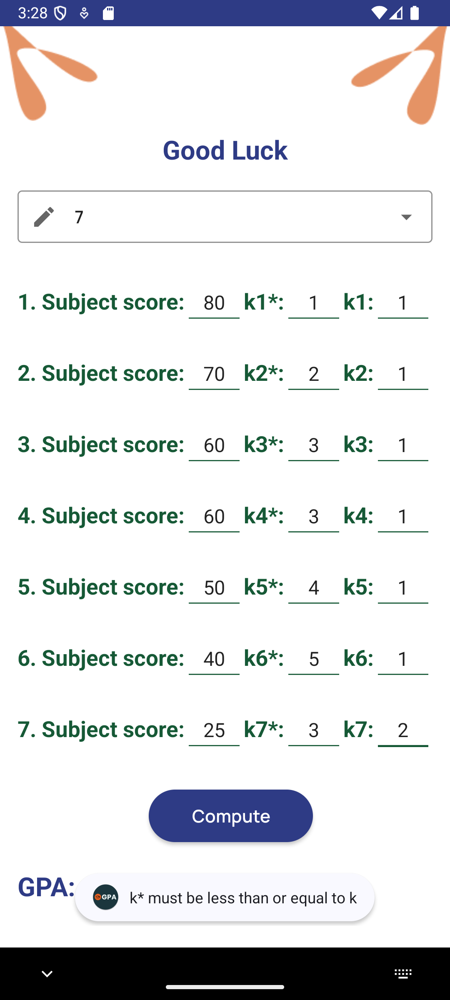
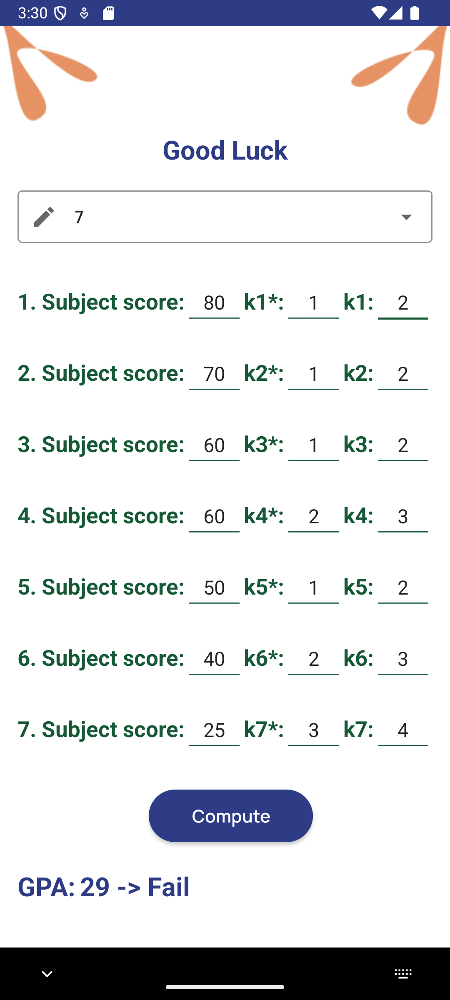
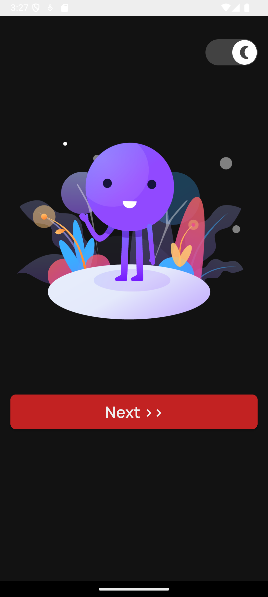
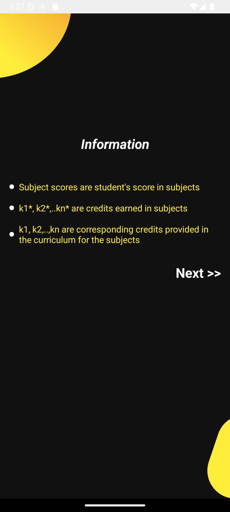
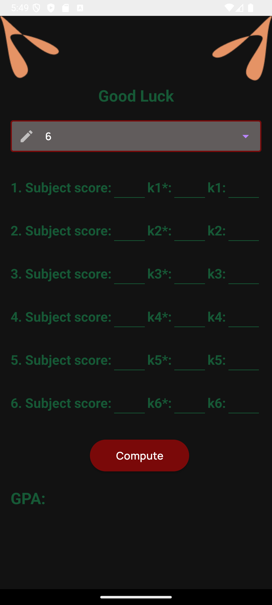
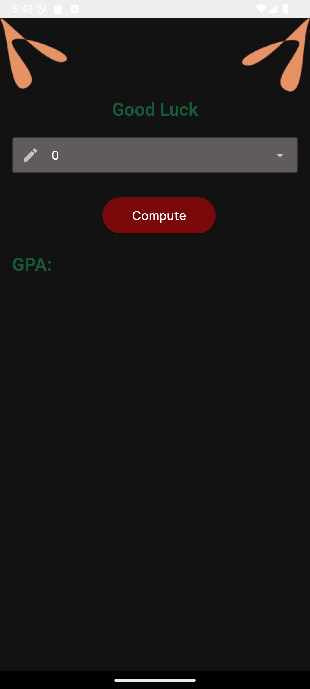

📘 GPA App

GPA App is a simple and efficient application designed to calculate your GPA easily.

🚀 Features

Light/Dark Mode: Seamlessly switch between light and dark themes based on user preference.

Information Page: Provides detailed insights into GPA calculations.

Calculation Page: Computes GPA based on user-inputted data.

🏗 Structure

📌 Screen 1: Settings Page

Users can toggle between Light Mode and Dark Mode.

📌 Screen 2: Information Page

Displays essential details and guidance on GPA calculations.

📌 Screen 3: Calculation Page

Users enter their grades and credits to obtain their GPA results.

📖 How to Use?

Open the application.

Navigate to the Settings Page to switch between Light/Dark Mode.

Learn about GPA from the Information Page.

Go to the Calculation Page and enter your details to compute your GPA.

📱 Screenshots

🌞 Light Mode

| Welcome Screen Light Mode                   | Information Screen Light Mode    |
| ---------------------------------------     | -------------------------------- |
|  |  |

| Main Screen Light Mode |
| ---------------------------------------     | -------------------------------- |
|  |  |

| Main Screen Light Mode |
| ---------------------------------------     | -------------------------------- |
|  |  |

🌙 Dark Mode

| Welcome Screen Dark Mode                    | Information Screen Dark Mode          |
| ---------------------------------------     | -----------------------------------   |
|  |  |

| Main Screen Dark Mode                  | Main Screen Dark Mode                  |
| ------------------------------------   | -----------------------------------    |
|  |  |